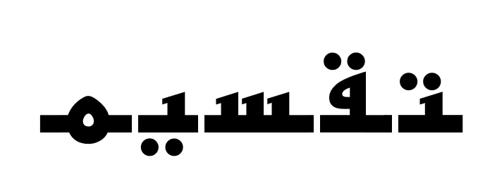

 <p align="center"> 
 
 </p>
 
**tkseem (تقسيم)** is a tokenization library that encapsulates different approaches for tokenization and preprocessing of Arabic text. We provide different preprocessing, cleaning, normalization and tokenization algorithms for Arabic text. 

## Features
* Cleaning
* Normalization
* Segmentation
* Tokenization

## Installation
```
pip install tkseem
```

## Usage 

### Preprocessors

```python
import tkseem as tk
tokenizer = tk.WordTokenizer()
tokenizer.process_data('samples/data.txt', clean = True, segment = True, normalize = True)
```

### Tokenization
```python
import tkseem as tk
tokenizer = tk.WordTokenizer()
tokenizer.process_data('samples/data.txt')
tokenizer.train()

tokenizer.tokenize("السلام عليكم")
tokenizer.encode("السلام عليكم")
tokenizer.decode([536, 829])
```

### Large Files
```python
import tokenizers as tk

# initialize
tokenizer = tk.WordTokenizer()
tokenizer.process_data('samples/data.txt')

# training 
tokenizer.train(large_file = True)
```

### Caching 
```python
tokenizer.tokenize(open('data/raw/train.txt').read(), cache = True)
```

### Save and Load
```python

import tkseem as tk

tokenizer = tk.WordTokenizer()
tokenizer.process_data('samples/data.txt')
tokenizer.train()

# save the model
tokenizer.save_model('vocab.pl')

# load the model
tokenizer = tk.WordTokenizer()
tokenizer.load_model('vocab.pl')
```

### Model Agnostic
```python
import tokenizers as tk
import time 
import seaborn as sns
import pandas as pd

def calc_time(fun):
    start_time = time.time()
    fun().train()
    return time.time() - start_time

running_times = {}

running_times['Word'] = calc_time(tk.WordTokenizer)
running_times['SP'] = calc_time(tk.SentencePieceTokenizer)
running_times['Random'] = calc_time(tk.RandomTokenizer)
running_times['Auto'] = calc_time(tk.AutoTokenizer)
running_times['Disjoint'] = calc_time(tk.DisjointLetterTokenizer)
running_times['Char'] = calc_time(tk.CharacterTokenizer)
```
## Notebooks 
We show how to use `tkseem` to train some nlp models. 
<table class="tg">

  <tr>
    <th class="tg-yw4l"><b>Name</b></th>
    <th class="tg-yw4l"><b>Description</b></th>
    <th class="tg-yw4l"><b>Notebook</b></th>
  </tr>
  <tr>
    <td class="tg-yw4l">Demo</td>
    <td class="tg-yw4l">Explain the syntax of all tokenizers. </td>
    <td class="tg-yw4l"><a href="https://colab.research.google.com/github/ARBML/tkseem/blob/master/tasks/demo.ipynb">
    
    </a></td>
  </tr>
  <tr>
    <td class="tg-yw4l">Sentiment Classification</td>
    <td class="tg-yw4l"> WordTokenizer for processing sentences and then train a classifier for sentiment classification. </td>
    <td class="tg-yw4l"><a href="https://colab.research.google.com/github/ARBML/tkseem/blob/master/tasks/sentiment_analysis/Sentiment%20Analysis.ipynb">
    
    </a></td>

  </tr>

  <tr>
    <td class="tg-yw4l">Meter Classification</td>
    <td class="tg-yw4l">CharacterTokenizer for meter classification using bidirectional GRUs. </td>
    <td class="tg-yw4l"><a href="https://colab.research.google.com/github/ARBML/tkseem/blob/master/tasks/meter_classification/Poetry%20Classification.ipynb">
    
    </a></td>
  </tr>
<table>

## Citation
```
@misc{tkseem2020,
  author = {Zaid Alyafeai and Maged Saeed},
  title = {tkseem: A Tokenization Library for Arabic.},
  year = {2020},
  publisher = {GitHub},
  journal = {GitHub repository},
  howpublished = {\url{https://github.com/ARBML/tkseem}}
}
```

## Contribution 
This is an open source project where we encourage contributions from the community. 

## License
[MIT](LICENSE) license. 
